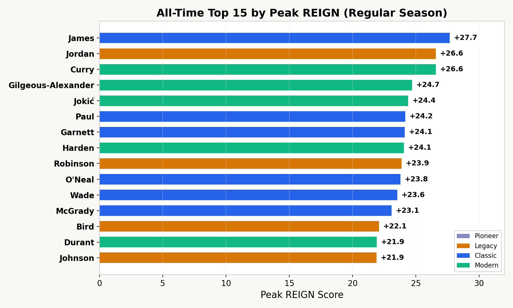
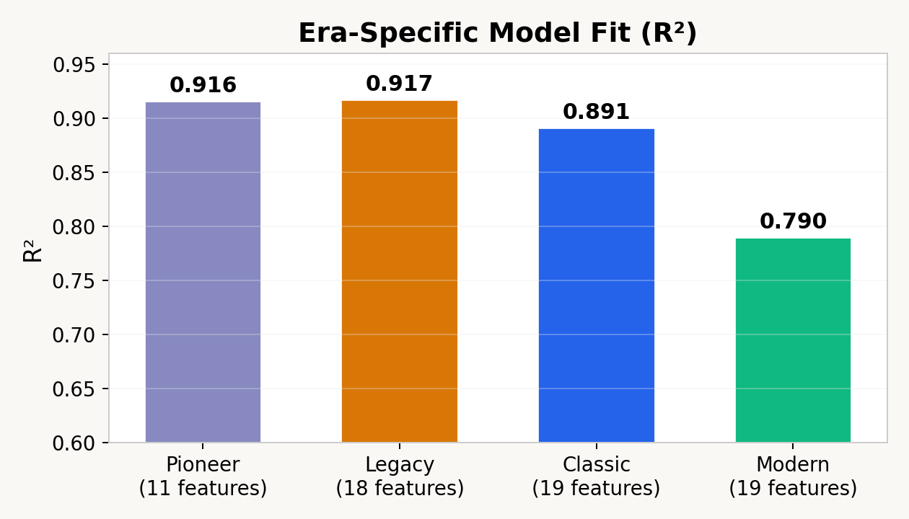
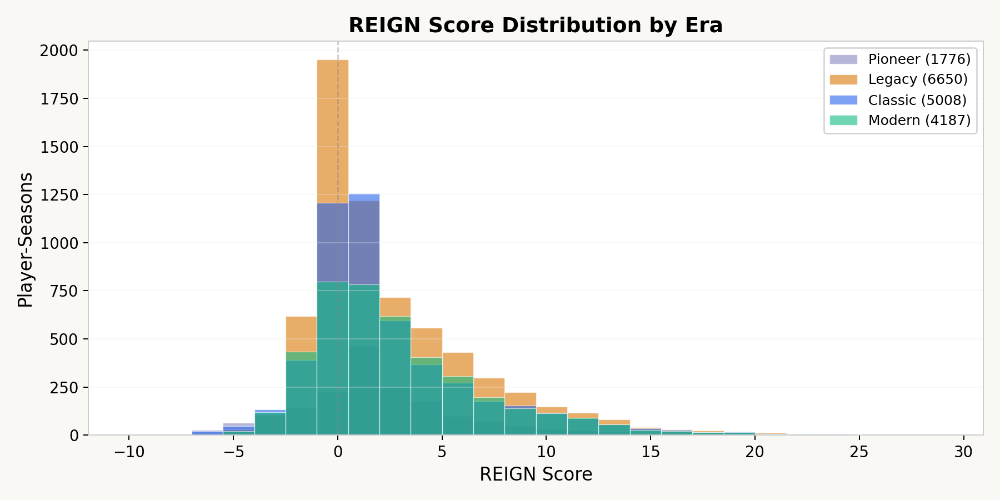
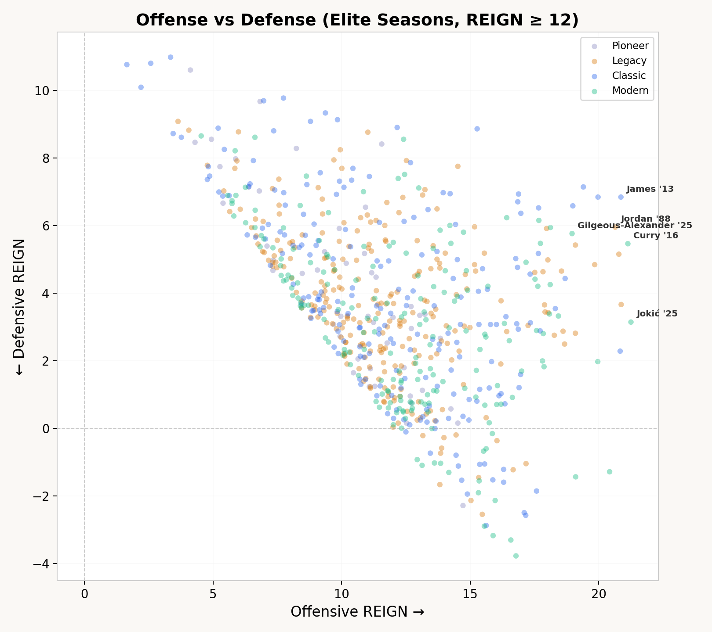
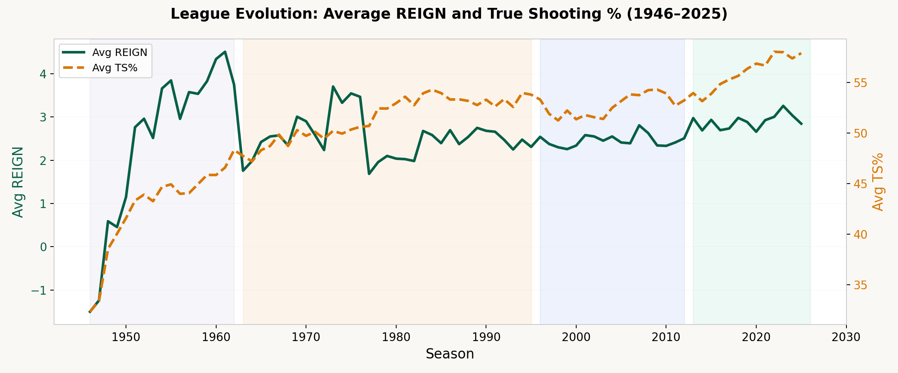

# REIGN — NBA Analytics

> Quantifying NBA player impact across 80 years of basketball using era-specific composite models.



## Research Paper

The full methodology is documented in our formal research paper:

**[REIGN: A Composite Metric for Quantifying NBA Player Impact Across Eras](docs/REIGN_Methodology_Paper.pdf)**

*Samir Kerkar — Courtside Analytics, March 2026*

Key contributions:
- Four era-specific models with `REIGN = REIGN_OFF + REIGN_DEF`, fit on era-normalized features
- Re-derived, fully reproducible per-era formulas published as [`reign_formulas.json`](public/data/reign_formulas.json)
- Role-relative defensive floor for the pre-1962 era, where no individual defensive stats exist
- Playoff opponent strength adjustment based on opposing team quality
- 29,969 player-seasons, 3,484 players, 1946–2025

## All-Time Top 10 by Peak REIGN

| # | Player | Year | Peak REIGN |
|---|--------|------|------------|
| 1 | LeBron James | 2013 | +27.70 |
| 2 | Michael Jordan | 1988 | +26.59 |
| 3 | Stephen Curry | 2016 | +26.59 |
| 4 | Shai Gilgeous-Alexander | 2025 | +24.72 |
| 5 | Nikola Jokic | 2025 | +24.40 |
| 6 | Chris Paul | 2009 | +24.18 |
| 7 | Kevin Garnett | 2004 | +24.13 |
| 8 | James Harden | 2019 | +24.06 |
| 9 | David Robinson | 1994 | +23.88 |
| 10 | Shaquille O'Neal | 2000 | +23.81 |

## How REIGN Works

Every score decomposes exactly into an offensive and a defensive component:

```
REIGN = REIGN_OFF + REIGN_DEF
```

Because the available statistics differ fundamentally across NBA history, **a separate model is fit for each era** on era-normalized (z-scored) features. The recovered per-era fits:



| Era | REIGN_OFF R² | REIGN_DEF R² | Dominant inputs |
|-----|:---:|:---:|---|
| **Pioneer** (1946-62) | 0.93 | 0.67 | OWS, PTS, AST, TS% — *no STL/BLK/BPM exist* |
| **Legacy** (1963-95) | 0.87 | 0.83 | OWS, DWS, DREB, STL, DBPM |
| **Classic** (1996-2012) | 0.94 | 0.86 | OWS, OBPM, STL, DREB, DBPM |
| **Modern** (2013-25) | 0.80 | 0.48 | PTS·TS%, OWS, STL, BLK, DBPM |

*(cross-validated R²; a flexible model lifts these ceilings to 0.94–0.98 everywhere except Modern defense, which is capped by missing advanced-stat coverage, not model form.)*

Two eras get special handling on defense: **Pioneer** has no individual defensive stats at all (steals/blocks weren't recorded until 1973-74), so REIGN_DEF there is a *role-relative floor* calibrated to the earliest measurable seasons rather than a fabricated estimate. Scores are era-normalized so +20 REIGN means the same relative dominance whether it's 1988 or 2024.

> **Formula spec:** the full per-era coefficients, intercepts, and z-score constants are published in [`public/data/reign_formulas.json`](public/data/reign_formulas.json), reproducible via `scripts/derive_formulas.py`. Methodology notes: [`docs/REIGN_FORMULAS.md`](docs/REIGN_FORMULAS.md).





## Features

- **Leaderboard** — Sortable rankings with era filtering, 1yr/3yr/5yr peak views, clutch stats
- **Player Profiles** — Career arcs, skill radar, season heatmaps, award shelf for 3,484 players
- **Head-to-Head Compare** — Side-by-side stats, peak bars, trajectory overlay, radar, PNG export
- **Era Explorer** — Deep-dive into each era with evolution charts and cross-era tables
- **Visualizations** — League trends, OFF vs DEF scatter, age distribution, REIGN distribution
- **RS/PO Toggle** — Every page supports Regular Season and Playoff modes
- **Opponent-Adjusted Playoffs** — Scale playoff REIGN by opposing team quality
- **URL-Shareable Comparisons** — `?v=compare&p1=LeBron+James&p2=Michael+Jordan`



## Tech Stack

- React 19 + Vite 7
- Custom SVG charts + Recharts
- IBM Plex Sans + Source Serif 4 typography
- Service worker for data caching (stale-while-revalidate)
- Fuzzy player search (accent-tolerant, typo-friendly)
- html2canvas for PNG export (lazy-loaded)

## Development

```bash
npm install
npm run dev
```

## Build and Deploy

```bash
npm run build
```

Output goes to `dist/`. Works with Vercel, Netlify, or any static hosting.

**Vercel (recommended):** Push to GitHub, import in Vercel, deploy. No config needed.

## Data

Split into parallel-loaded era files for fast initial load:

| File | Size | Gzipped |
|------|------|---------|
| `seasons_pioneer.json` | 1.4 MB | 0.2 MB |
| `seasons_legacy.json` | 5.3 MB | 1.1 MB |
| `seasons_classic.json` | 6.5 MB | 1.2 MB |
| `seasons_modern.json` | 5.1 MB | 0.8 MB |

Additional: `awards.json`, `stretches_rs3/rs5/po3/po5.json`, `career_avg_rs/po.json`, `career_clutch.json`

## Scripts

- `scripts/derive_formulas.py` — Re-derive the per-era REIGN formulas → `reign_formulas.json`
- `scripts/adjust_pioneer_defense.py` — Role-relative defensive floor for the pre-1962 era
- `scripts/build_derived.py` — Rebuild stretches / careers / career_avg from the season files
- `scripts/backfill_modern_advanced.py` — Fetch missing modern advanced stats from Basketball-Reference
- `scripts/generate_paper.py` — Generate the methodology PDF (with figures)
- `scripts/refresh_current_season.py` — Scrape the in-progress season from Basketball-Reference and score it with the published formulas
- `scripts/backfill_clutch.py` — Pull current-season clutch stats from the stats.nba.com API
- `scripts/build_career_clutch.py` — Fold new clutch games into the `career_clutch.json` leaderboard
- `scripts/reign_score.py` — Apply `reign_formulas.json` to score a row (the forward direction of `derive_formulas.py`)
- `scripts/refresh_all.sh` — One-shot nightly refresh: scrape → score → clutch → rebuild every derived/index file

## Daily Auto-Refresh

The live site keeps itself current without manual work. A scheduled GitHub
Action (`.github/workflows/refresh-data.yml`) runs every morning (11:00 UTC,
after the prior night's games are final) and:

1. **Scrapes** the in-progress season's per-game + advanced tables from
   Basketball-Reference (`refresh_current_season.py`).
2. **Scores** every player with the frozen per-era REIGN formulas
   (`reign_score.py` applying `reign_formulas.json`) — so new seasons land on
   the exact same ruler as the historical 80 years.
3. **Pulls clutch** stats for the season from the stats.nba.com API
   (`backfill_clutch.py`) and folds new clutch games into the clutch
   leaderboard (`build_career_clutch.py`).
4. **Rebuilds** the derived data the site loads — careers, stretches,
   career averages, the leaderboard index, and the visualization payload.
5. **Commits** the changed `public/data/*.json` back to the repo, which
   triggers the host (Netlify/Vercel) to redeploy. A no-change night is a
   clean no-op — nothing is committed.

Only the current season is refreshed each run: the historical eras (1946–2012)
are frozen and never change, so nightly diffs stay small. Run it by hand with:

```bash
npm run refresh             # auto-detect the current season
npm run refresh -- --year 2026
```

> **Scoring:** new numbers use the published reconstructed formulas (the model
> the repo ships), so they carry that model's reconstruction error, not the
> original uncommitted pipeline's.
>
> **Clutch:** only regular-season clutch is refreshed (the only clutch the
> season files carry); playoff clutch in `career_clutch.json` is preserved
> from the committed data. New current-season players join the clutch
> leaderboard once they cross its ~10-game floor.
>
> **⚠️ Source access from CI:** both Basketball-Reference and stats.nba.com
> aggressively block **datacenter / cloud IPs** — which is exactly what
> GitHub-hosted runners use — so a scheduled run may get HTTP 403 even with
> correct browser headers. Each fetcher fails *loud and writes nothing* rather
> than committing partial data; the clutch step is best-effort so a clutch
> block doesn't abort the core REIGN refresh. If runs are blocked, the fix is
> a non-datacenter egress: a [self-hosted runner](https://docs.github.com/actions/hosting-your-own-runners)
> on a residential/static IP, or routing the fetch through a proxy.
> Additionally, Sports-Reference's [data-use policy](https://www.sports-reference.com/data_use.html)
> asks that you not build tools/sites on their scraped data without permission
> and caps requests at 20/min — worth reviewing before running this publicly;
> the nba.com stats API is the less restrictive source for the same numbers.

## License

Research and data for non-commercial use.
